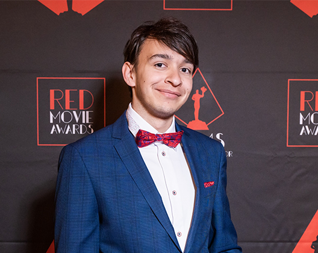
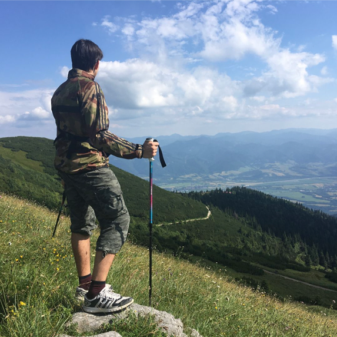
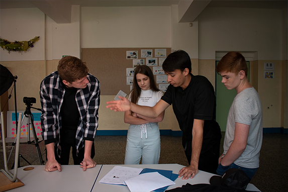
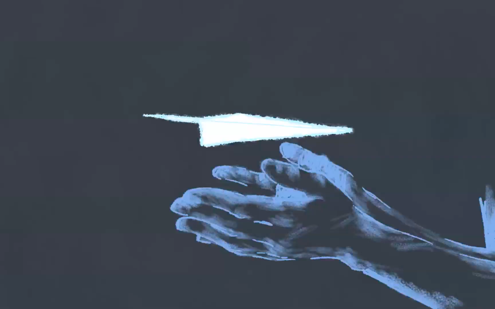
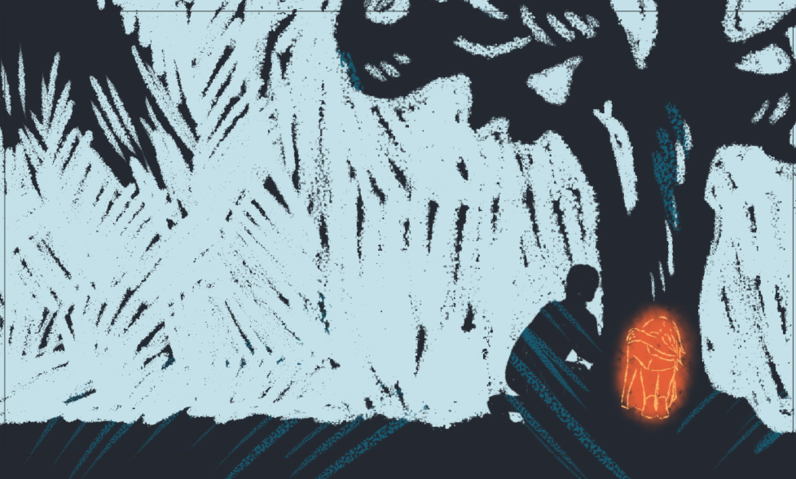
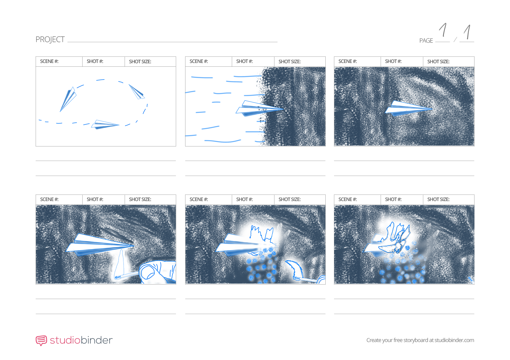
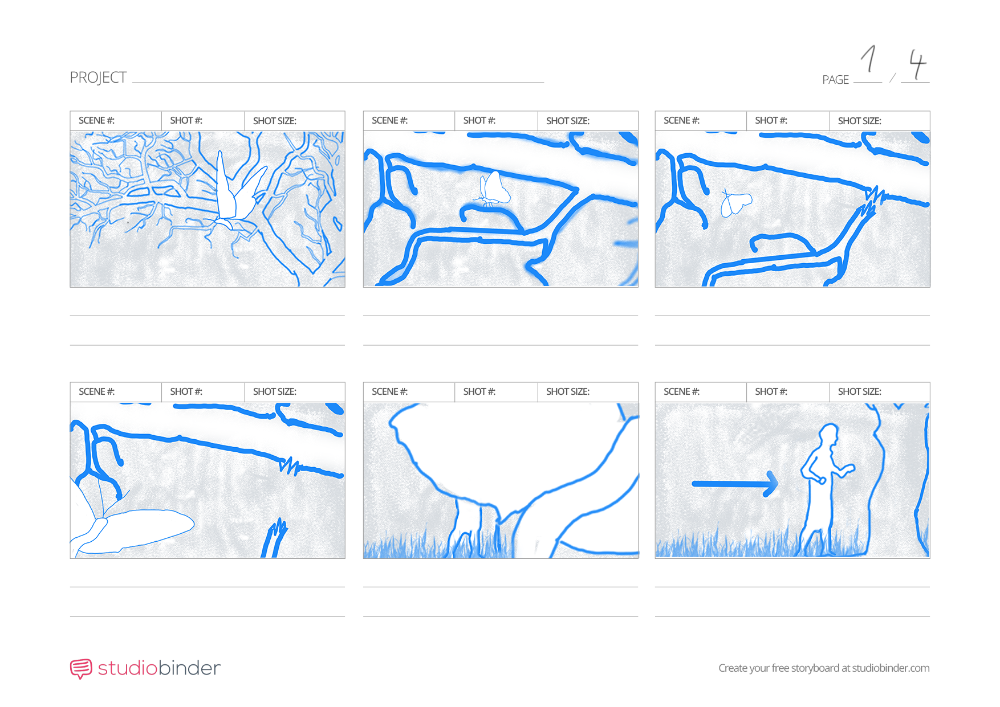
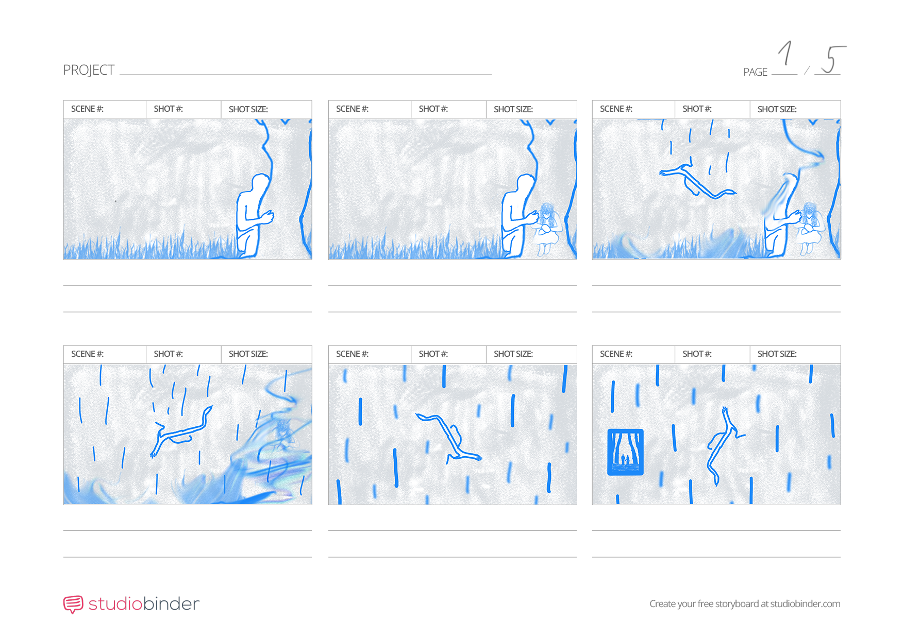
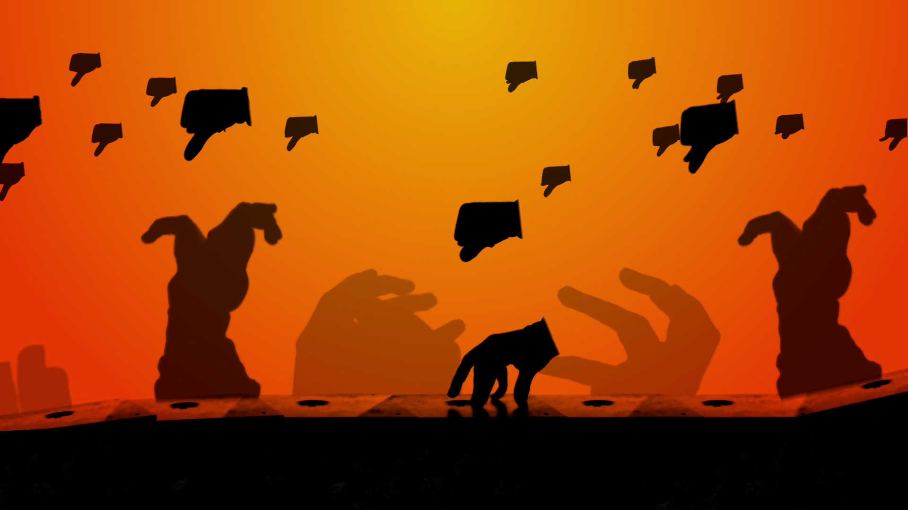

# Visual storytelling is my passion:

## Benjamín Haverla – Filmmaker:

In my homeland of Slovakia, the gift of nature inspires my creativity. To learn more about me, [click](https://github.com/BenjaminHaverla/Main-about-me.git) without hesitation.

## ABOUT MY FEATURED PROJECTS:

My main career goal is to become a film director. I'm aware of the thorny path, a journey intertwined with my passion. That's why I would like to [share with you my small steps.](https://github.com/BenjaminHaverla/About-my-featured-projects.git)

# The project I'm working on (2023 – ???)

## About this project:

This is my ambitious project where I am trying to infuse a part of my soul. Why did I start this project? Well, at my university, we are required to create a bachelor animation at the end of the last semester.

Before this, I felt the need to express myself again with a theme of love. I've grown up, and I now perceive the world differently than before. My short film "THE LAST LETTER" was about love and was created in 2021.

Perhaps you can find some connections there, but this new project will be an animated music video about love with a fresh point of view.

## Storyboard

## Challenges:
We've officially completed 1 minute, but the music video will likely feature 4 minutes of animation. So, there's still a lot ahead of us. I created the storyboard and animatic for my friend, Nataša Strelová. She excels at hand-drawn animation, which is why I chose to collaborate with her.

**Our Team:**

Benjamín Haverla (Me) –> Producer/Director

Nataša Strelová –> 2D Animator

Oto Haverla (My Father) –> Music Composer

# [UKUPHILA – experimental project (2021)](https://github.com/BenjaminHaverla/UKUPHILA-experimental-project.git)
If you would like to know more about this project, don't hesitate to [click here](https://github.com/BenjaminHaverla/UKUPHILA-experimental-project.git).

# [The performance in Add (2018)](https://github.com/BenjaminHaverla/The-performance-in-Add.git)
If you would like to know more about this project, don't hesitate to [click here](https://github.com/BenjaminHaverla/The-performance-in-Add.git).

# [3D Character Animation](https://github.com/BenjaminHaverla/3D-Character-Animation.git)
If you would like to know more about my workflow, don't hesitate to [click here](https://github.com/BenjaminHaverla/3D-Character-Animation.git).

https://github.com/BenjaminHaverla/First-impression/assets/149423594/1f77d93d-36aa-4449-b264-320aded864c4 

> *"3D character animation created by Benjamín Haverla (Me)"*

-------------------------------------------------------------

# BACK TO THE...
## [Main Page (English for designers)](https://github.com/BenjaminHaverla/English-for-designers.git)
# Contact me:
## **Mail**: haverla.tros@gmail.com

-------------------------------------------------------------

#### [<– BACK](https://github.com/BenjaminHaverla/English-for-designers.git)
